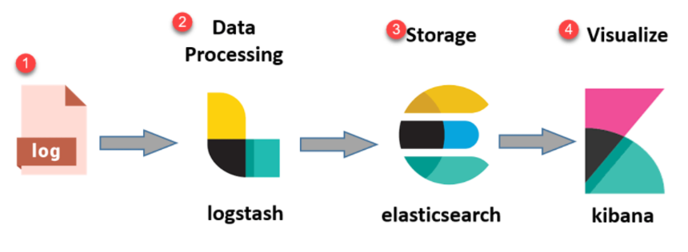

# What Is ELK?
---

## ELK stands for

* E = Elasticsearch
* L = Logstash
* K = Kibana

These are three different open source components/application that forms an ecosystem and that ecosystem is called ELK Stack. we will take a use case of application logging and then explain that why ELK stack has become so much famous in today's software industry.

---

> ### Logging in Monolithic Application
A monolithic application has following features

* It's a large codebase written as a single application.
* This large application writes log into a single file.
How we view logs in Monolithic application

If you want to view logs of a monolithic application then its is very easy because you have a single log file.

* You can go to the machine where log file is present.
* Just open or tail the log file you can view the logs
---
> ### Logging in Microservice Architecture
The current software industry is heavily influenced by the microservice architecture, and most of the companies follow the microservice architecture for their application development.

The microservice architecture has following features

* There are large number of smaller application. All these smaller application/services come together to achieve a bigger goal.
* Microservice can be scattered across the network which means that services can be deployed on different machines.
* Each microservice has its own log
* Thus, the logs are present of different machine
* This creates as serious issue. Now if you want to view the logs then you have to goto different machine and then view logs for each microservices. Sometimes this is frustrating and time consuming

### __we need a centralized place where logs can be aggregated__

Here comes the power of ELK stack which can help you do centralized logging

---
> ### Elasticsearch
This is the most important part or heart of ELK stack.

* Elasticsearch acts as a database where you can store a large amount of data.
* You can write search queries over this data using REST Apis

Considering our microservice logging example

* Elasticsearch will store the logs of different microservice
* This acts as a centralized place where logs are stored

 

> ### Logstash
Logstash plays an important role in data movement. Logstash has three main responsibilites.

1. Ingestion : Logstash reads data from multiple sources. It can be file, messaging queue, database etc.

2. Transformation : Logstash can also help in transformation or enrichment of data. Like you can take a unstructured data and convert that to a meaningful structure for better reading. Logstash has __many built in plugins__ that helps in data transformations. The most important plugin is grok.

3. Sink : Once data is transformed then it should be dumped or sent to some place. In ELK ecosystem logstash pushes data to Elasticsearch
Considering the microservice logging example

* Logstash will read data from all the logs file of the microservice and then dump/push that log data to elasticsearch

> ### Kibana
* Kibana lets you visualize the data that is stored in Elasticsearch.
* It acts as a graphical user interface for the elasticsearch data

Considering the microservice logging example

* Kibana will help you to see the logs of all the microservice
* You can query over the data using Kibana and get meaning full results
