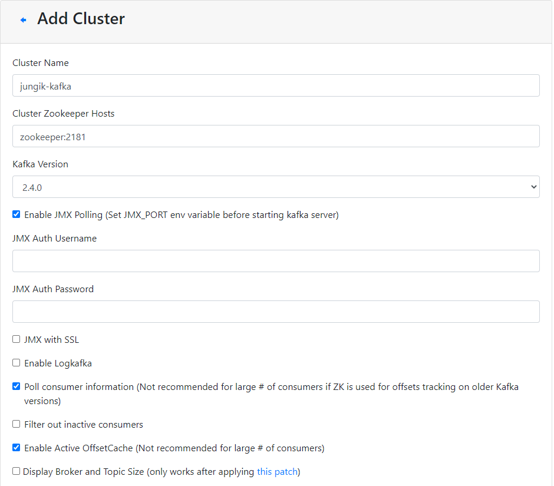

# Create Date Pipeline using Kafka-ELK

### \# Data Pipeline architecture


1. Kafka Server : 데이터가 처음 publish되는 곳
2. Producer : Producer는 데이터를 카프카 토픽으로 내보낸다.
3. Elasticsearch : 카프카로부터 데이터를 받아들여 데이터베이스로 역할한다.
4. Logstash : 카프카 토픽에서 데이타를 읽어 엘라스틱서치로 데이터를 넣어주는 middle man으로서 역할한다.
5. Kibana : 데이터를 GUI 및 대시보드 형태로 나타내준다.

---

### \# Prerequiste

* Ubuntu Desktop 18.04 단일 서버 환경에서 실행했다.
* Python 3.6.9 버전을 이용했다.
* Docker compose를 이용해 application을 설치했다.
  * docker 및 docker compose 설치

---

### \# Making the Environment Ready

> Kafka & Zookeeper & Kafka Manager

* [Install Kafka-Zookeeper-KafkaManager Using Docker Composer]

> Elasticsearch & Kibana

* [Install Elasticsearch and Kibana using Docker Compose]

> Logstash

* [[Install Logstash on Ubuntu 18.04]

---

### \# Kafaka Producer

파이썬에서 제공하는 Faker 모듈을 이용해 가상의  user log를 만들어 보자

우선 홈 폴더에 Kafka-elk라는 폴더를 만들었다.

```python
pip install Faker
# 가상의 메시지를 만들어 줄 녀석
pip install kafka-python
# 카프카에서 파이썬을 사용할 수 있도록 제공하는 모듈
```

```python
# producer.py

from faker import Faker
from kafka import KafkaProducer
import json
import time

fake = Faker()

def get_registered_user():
	return {
		"name" : fake.name(),
		"address" : fake.address(),
		"created_at" : fake.year()
	}

def json_serializer(data):
	return json.dumps(data).encode("utf-8")
	
producer = KafkaProducer(bootstrap_servers=['localhost:9092'],
                         value_serializer=json_serializer)

if __name__ == "__main__":
    while:
        registered_user = get_registered_user()
        print(registered_user)
        producer.send("registered_user", registered_user)
        time.sleep(4)
```

```python
# consumer.py

from kafka import KafkaConsumer
from json import loads
import time

if __name__ == "__main__":
    while:
        consumer = KafkaConsumer(
            'registered_user',
            bootstrap_servers=['localhost:9092'],
            auto_offset_reset='latest',
            enable_auto_commit=True,
            value_deserializer=lambda x: loads(x.decode('utf-8')),
            consumer_timeout_ms=1000)
        
        for msg in consumer:
            print(f"Registered user ={msg.value}")
        
```

---

### \# Kafka manager 구성

* 위 순서에 맞게 카프카 컨테이너를 성공적으로 구성했다면
  서버를 통해 접속할  수 있다.
* 웹을 통해 `[machine IP]:9000` 로 접속
* Add Cluster를 선택하여 아래와같이 Cluster를 구성



---

### \# 

